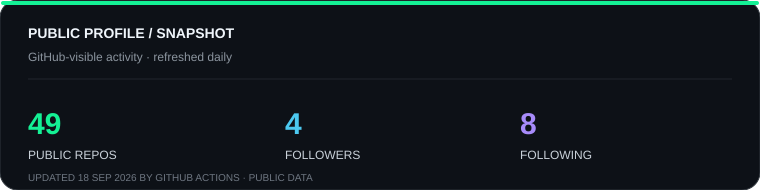
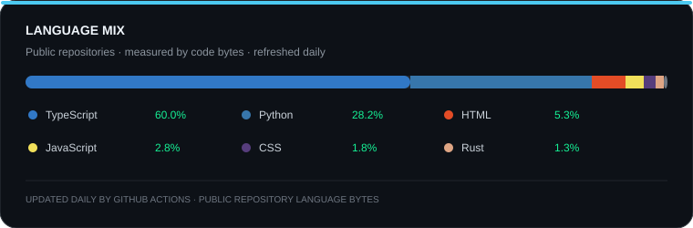
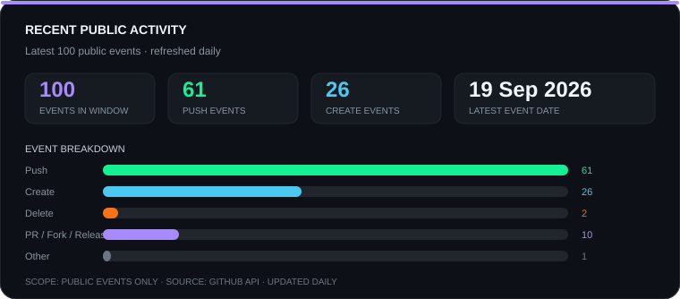

<div align="center">

# Godtime Benson
### `mrphatom`

**Full-Stack + Solana Engineer** · B.Sc. Computer Science @ Rivers State University

[](https://github.com/mrphatom)

</div>

```bash
$ status        shipping
$ team_size     1
$ stack         solana · rust · react · typescript
```

## System Config

```typescript
const Godtime = {
  status: "B.Sc. Computer Science @ RSU",
  roles: ["Full-Stack Engineer", "Solana Developer"],
  current_focus: {
    building: ["mappers_contract", "Archemist", "solana-rpc-proxy", "reactive-sentinel", "Anchr"],
    shipping: "Mappers Protocol — mainnet path + oracle hardening",
    researching: ["Solana infrastructure & indexing patterns", "on-chain settlement systems"]
  }
};
```

<details>
<summary><b>Background</b></summary>
<br>

- **Freelance Dev** — Landing pages, portfolio sites, and custom applications.
- **Data & Security** — Prior experience in data platform engineering and Web3 moderation.
- **Web3 Architecture** — Focused on the Solana ecosystem and EVM cross-chain systems.
- **Solo Builder** — Every project below was designed, implemented, tested, and shipped end-to-end by one person.

</details>

## Deployed Architecture

**Core Protocol & Infrastructure**

- **[mappers_contract](https://github.com/mrphatom/mappers_contract)**<br/>
  Decentralized freelance escrow on Solana. Anchor program with dual-PDA architecture and a dual-model verification oracle that checks deliverables and settles payment autonomously.

- **[solana-rpc-proxy](https://github.com/mrphatom/solana-rpc-proxy)**<br/>
  Production FastAPI proxy for Solana RPC — rate limiting, structured errors, and signed account-change webhooks.

- **[reactive-sentinel](https://github.com/mrphatom/reactive-sentinel)**<br/>
  Cross-chain security state machine on Reactive Network. Detects contract events on Ethereum Sepolia and triggers automated mitigation on Base Sepolia within seconds.

- **[Anchr](https://github.com/mrphatom/Anchr)**<br/>
  CLI that deploys static frontends to IPFS and resolves them via SNS `.sol` domains.

**Product Surfaces**

- **[Archemist](https://github.com/mrphatom/Archemist)**<br/>
  Production-ready Web3 e-commerce template — Solana payments, glassmorphism UI, custom shaders, and headless Sanity CMS.

- **[LeadsRadar](https://github.com/mrphatom/LeadsRadar)**<br/>
  B2B CRM SaaS built for freelancers.

- **[tabpilot-](https://github.com/mrphatom/tabpilot-)**<br/>
  Browser automation agent for Chrome — natural-language tasks translated into navigation, clicks, and data extraction inside a sandboxed tab.

- **[PyMini](https://github.com/mrphatom/PyMini)**<br/>
  Lightweight interpreted language written from scratch in Python — lexer, parser, and tree-walk evaluator.

## Shipped, Not Just Started

| Feat | Status |
|---|---|
| Shipped a full Anchor escrow program solo | ✅ |
| Built a dual-model oracle for on-chain deliverable verification | ✅ |
| Built a CLI that deploys to IPFS and resolves `.sol` domains | ✅ |
| Shipped a cross-chain reactive security system with sub-second response | ✅ |
| Built a Web3 commerce template with custom shaders | ✅ |
| Built a language interpreter from scratch | ✅ |

## Stats

<!-- The local SVG cards below are refreshed daily by .github/workflows/update-profile-stats.yml. -->

<p align="center">
  
</p>

<p align="center">
  
</p>

<p align="center">
  
</p>

<p align="center">
  
</p>

## Code Snake

<div align="center">
  <picture>
    <source media="(prefers-color-scheme: dark)" srcset="https://raw.githubusercontent.com/mrphatom/mrphatom/output/github-contribution-grid-snake-dark.svg?v=33">
    
  </picture>
</div>

## Recent Articles

<!-- BLOG-POST-LIST:START -->
- [Turning Solana Programs into Blinks: A Guide to Solana Action](https://medium.com/@mrphatom/turning-solana-programs-into-blinks-a-guide-to-solana-action-1bab3a4ad386?source=rss-e3867e77f3c8------2)
- [Indexing Solana State: Why You Need Helius Webhooks Instead of Polling](https://medium.com/@mrphatom/indexing-solana-state-why-you-need-helius-webhooks-instead-of-polling-2c306b23e135?source=rss-e3867e77f3c8------2)
- [Fast Solana Testing: Moving Beyond ⁠solana-test-validator⁠ with Bankrun](https://medium.com/@mrphatom/fast-solana-testing-moving-beyond-solana-test-validator-with-bankrun-f33023c68e95?source=rss-e3867e77f3c8------2)
- [Mastering CPIs on Solana: Calling Other Programs Without Losing Your Mind](https://coinsbench.com/mastering-cpis-on-solana-calling-other-programs-without-losing-your-mind-bc60fab7dd60?source=rss-e3867e77f3c8------2)
- [Building Low-Latency Escrow Protocols on Solana: What I Learned Building On-Chain](https://medium.com/@mrphatom/building-low-latency-escrow-protocols-on-solana-what-i-learned-building-on-chain-df851b9dcd83?source=rss-e3867e77f3c8------2)
<!-- BLOG-POST-LIST:END -->

## Contact

**Open to strong Solana / full-stack Web3 roles and interesting protocol work.**

<div align="center">
  <a href="https://open.spotify.com/user/315p5pw5k6ex56i3344x5cq2iydu"></a>
  <br/><br/>
  <a href="https://x.com/iamphatom_"></a>
  <a href="https://mrphatom.is-a.dev"></a>
  <a href="https://t.me/iamphatom"></a>
</div>

<div align="center">
  
</div>

### `mew mew mew`

<div align="center">
  <blockquote>
    <em>"See, you not only have to be a good coder to create a system like Linux, you have to be a sneaky bastard."</em><br/>
    <strong>— Linus Torvalds</strong>
  </blockquote>
  <br/>
  
</div>
